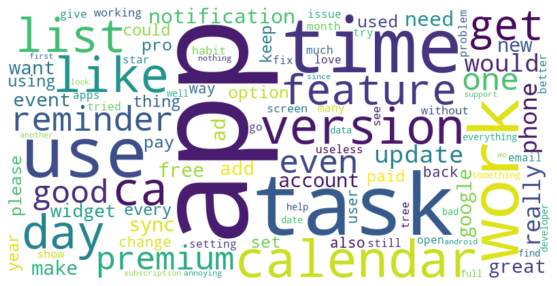

# Words-Clustering
DataCamp Project: Reveal Categories found in data

As a Data Scientist working for a mobile app company, you usually find yourself applying product analytics to better understand user behavior, uncover patterns, and reveal insights to identify the great and not-so-great features. Recently, the number of negative reviews has increased on Google Play, and as a consequence, the app's rating has been decreasing. 

Objective

The goal was to identify and understand common themes in negative app reviews (i.e., reviews with a rating of 1 or 2), using unsupervised learning techniques.

# Steps Completed
Filtering Negative Reviews

Reviews were filtered where the score was either 1 or 2.

Only the content of these reviews was used for analysis.

# Preprocessing

Reviews were lowercased and tokenized.

Stop words and non-alphabetic tokens were removed.

Cleaned tokens were joined back into strings.

# TF-IDF Vectorization

TF-IDF was applied to the cleaned reviews to quantify term importance while ignoring common but uninformative words.

# Clustering with K-means

Reviews were grouped into 5 clusters using K-means.

Each review was assigned to a cluster, stored as a new category label.

# Topic Extraction

For each cluster, the term with the highest total TF-IDF weight was extracted.

The results were stored in a summary table (topic_terms DataFrame) containing:

The cluster label (category)

The top term (term)

Its TF-IDF frequency (frequency)

# Visualization

A horizontal bar plot was created to illustrate the top term for each cluster based on TF-IDF score.
